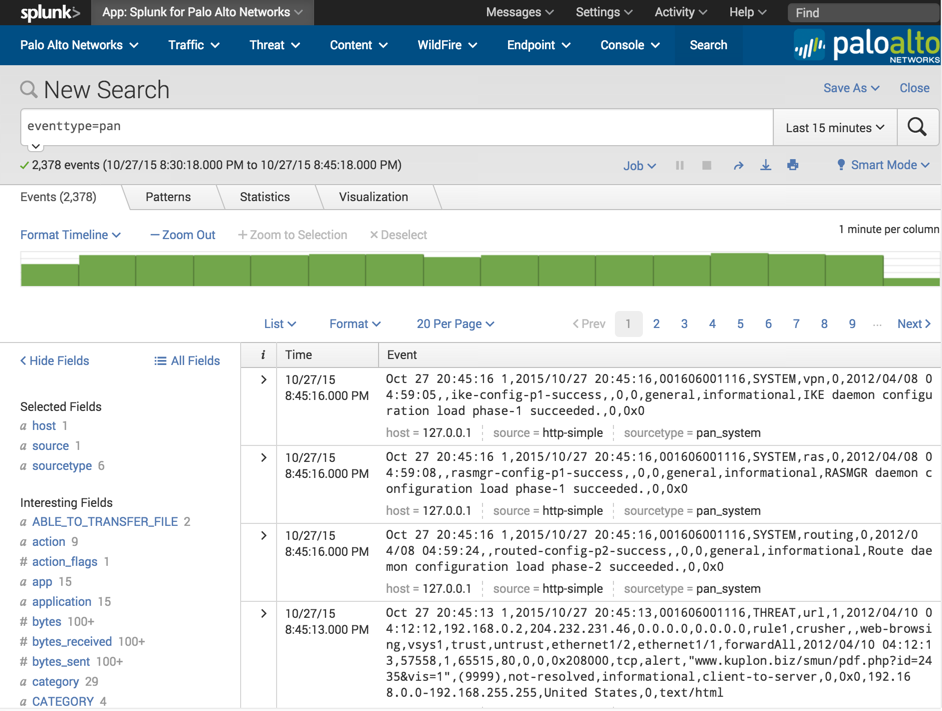
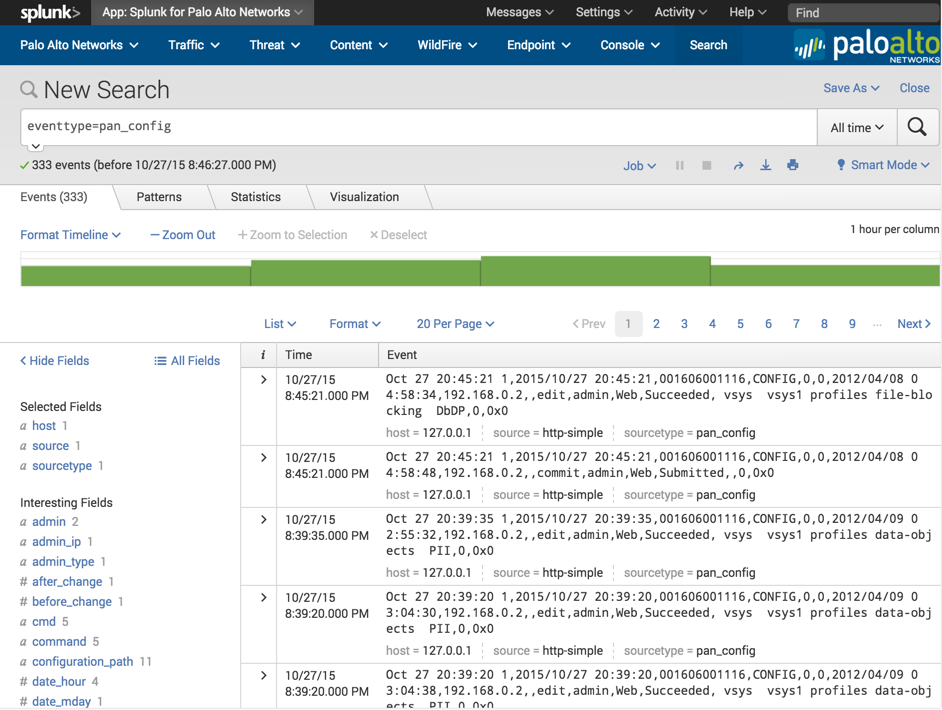
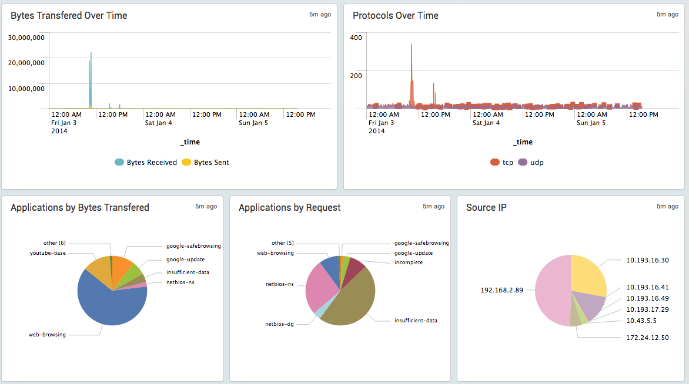

# Troubleshooting

## Common Problems and Solutions

### Problem after upgrading the App/Add-on

Check the [Release Notes](/release-notes.md) for actions needed during App/Add-on upgrade and ensure you completed all required actions for upgrade.

When upgrading any app in Splunk, configuration created by the Splunk administrator is leftover in the app's local directory. If the file in the local directory in the app is not compatible with the new version, then unexpected problems can happen. This is true for all apps in Splunk and a best practice is to backup and delete the local directory in the app after upgrading it if there are problems after the upgrade. Note that you might need to leave inputs.conf if that is how your logs are getting into Splunk.

### Dashboards not working

**All dashboards have no data**

Perform a search for `eventtype=pan` with 'All time' as the timeframe. If logs show up, then verify the timestamp of the logs is correct. If it is wrong, check that the clock and timezone on the Firewall/Panorama matches the Splunk server, or use NTP on both. See Troubleshooting Step 2 below for more detail.

**Only 'Overview' or 'Real-time Event Feed' dashboard has data**

The 'Overview' dashboard has data, but other dashboards do not, usually the datamodel is not fully built. This can happen on a Splunk server with not enough resources to summary index the data as it comes in. Increase the time range on the dashbaords with no data to 'All Time' to see if data shows up. Check the datamodel to see if it is 100% built. See Troubleshooting Step 4 below for more detail.

**'Overview' or 'Real-time Event Feed' dashboard has no data**

The 'Overview' dashboards has no data, but other dashboards work correctly, the clock on your firewall is a few minutes off, or the timezone is set wrong. The 'Overview' dashboard is a real-time 5 minute search, while the other dashboards pull a larger timeframe from the data model. So the 'Overview' is more suseptible to minor variations in system clock. Please verify the clock and timezone on Splunk and the Firewall/Panorama are set exactly the same.

### No WildFire Data

The [WildFire dashboard](/dashboards.md#wildfire) is empty or no WildFire data is appearing in the index. For Splunk to take advantage of WildFire, you log WildFire events from the Firewall/Panorama first. Splunk will leverage the WildFire cloud API to pull reports and IOC's from the WildFire analysis only after it receives notification of the WildFire event from the Firewall/Panorama.

Some things to check to get WildFire data into Splunk:

* If upgrading to App 5.3 or higher from a version before 5.3, you must set the WildFire API key in the Add-on Setup Screen, even if you previously set it in the App. See the [release notes](release-notes.md#app-53) for more information.
* Verify there are WildFire Submission logs in the Monitor tab on the Firewall/Panorama
* Verify WildFire logs are enabled in the Log Forwarding Profile on the Security policy rule which is generating WildFire events
* Verify WildFire events are received by Splunk with this search: `eventtype=pan_wildfire`
* If there are WildFire events \(syslogs\), verify there are also WildFire reports \(XML\) with this search: `eventtype=pan_wildfire_report`
* If there are WildFire events \(syslogs\) but not WildFire reports \(XML\), check the report gathering logs for errors in `$SPLUNK_HOME/var/log/splunk/python.log`.
* Check that you have configured the TA with the WildFire API Key, especially if upgrading from a pre-5.3 version of the App.

### Datamodel Build Problems

If using App 6.0 or higher, use the [Datamodel Audit](https://splunk.paloaltonetworks.com/dashboards.html#datamodel) dashboard to get visibility into the datamodels and what they are storing.

If the build percentage is stuck at less than 95%, the cause might be limited resources on the Splunk server being consumed by other apps. Try disabling unused apps, removing acceleration from other datamodels, or adding hardware resources. Splunk Enterprise Security uses an exceptional amount of compute resources which can starve the datamodels of other apps like the Palo Alto Networks App.  If Enterprise Security is installed on the same server as the Palo Alto Networks App, try separating them to different servers so they don't compete for compute resources.

If you need help troubleshooting performance problems with datamodels, you can open a case with Splunk Support. Note that Splunk Support will not troubleshoot the Palo Alto Networks App, but they can tell you what is causing any performance problems that prevent your datamodels from accelerating fast enough to keep up with new data.

## Troubleshooting Steps

Follow these troubleshooting steps if there are problems getting the dashboards to show data.

**Step 1. Check that all initial configuration is complete**

* Verify inputs.conf is set up per the [instructions](/firewalls-panorama-and-traps.md). inputs.conf must have the line `no_appending_timestamp = true` for UDP syslogs
* Check for other inputs.conf outside the App or Add-on that might be using the same port
* Check the firewall is not using a Custom Log Format \(must use the default log format\)
* Check the Endpoint Security Manager is using CEF format
* Check the firewall is set to log something like system events, config events, traffic events, and so on.
* Check that the clocks and timezones on the firewall and Splunk server are the same. If they are different, logs will not show up correctly.
* If using a TCP or SSL port for syslogs, try UDP instead, then switch to TCP or SSL once UDP is working

**Step 2. Verify logs are indexed**

Use the method described in the [Test the configuration](/firewalls-panorama-and-traps.md#test-the-configuration) section to produce some syslogs. Verify the logs are reaching the Splunk server by navigating to the Splunk for Palo Alto Networks app, click 'Search' in the navigation bar, then enter:

```
eventtype=pan
```



If no logs show up, then the logs are not getting indexed correctly. Use these steps to find the problem:

* Verify the configuration from Step 1 above.
* Switch the search timeframe to All Time. If logs show up, verify the timestamp is correct on the logs. If time is wrong, check that the Splunk server and firewall have the same time and timezone set. Use NTP if possible.
* Use tcpdump or Wireshark on the Splunk server to verify the logs are actually reaching it.
* Verify the App \(and Add-on when using App v5.0 and higher\) is installed on all searchheads, indexers, and heavy forwarders.
* If using App v3.x or 4.x, verify the pan\_logs index exists.

**Step 3. Verify logs are parsed correctly**

Use the method described above in the [Test the configuration](/firewalls-panorama-and-traps.md#test-the-configuration) section to produce some syslogs. Verify the logs are reaching the Splunk server by navigating to the Palo Alto Networks App, click 'Search' in the navigation bar, and enter the following search:

```
eventtype=pan_config
```



If logs showed in step 2, but no logs show up now, then the logs are not getting parsed correctly:

* Check that you are not using a Custom Log Format in the syslog server setting on the firewall.
* Check that the inputs.conf file is configured with the line "no\_appending\_timestamp = true" if using UDP syslogs.
* If you're using a third-party syslog forwarder between the Palo Alto Networks device and Splunk, verify the forwarder isn't modifying the logs.
* Verify the App \(and Add-on when using App v5.0 and higher\) is installed on all searchheads, indexers, and heavy forwarders.

**Step 4. Check acceleration and summary indexing**



Check that the dashboards are populating with data. The Overview dashboard doesn't use acceleration, so it should work at this point. If it doesn't, then go back to the previous troubleshooting steps. For all the other dashboards, after 5-8 minutes of syslogging to the Splunk server, the dashboards should populate with data. If the dashboards are populating, then acceleration and summary indexing are working. If not, check the following:

App Version 4.0 and earlier:  
Uses TSIDX for acceleration.

* Verify that saved searches for log collection are in the savedsearches.conf  
  file. Check that they haven't been changed or overwritten.

App Version 4.1 and later:  
Uses Data Model for acceleration.

* Check acceleration settings in the data model under Settings &gt; Data Model &gt;  
  and fine the Palo Alto Networks datamodels. \(There may be 1 or 3 datamodels depending on the App version\)

* Verify that acceleration is enabled for all Palo Alto Networks datamodels.

* Click the arrow next to the Palo Alto Networks data models and check the data model build percentage. It should be 100% or very close to it.

* If the build percentage is stuck at less than 95%, the cause might be limited resources on the Splunk server being consumed by other apps. Try disabling unused apps, removing acceleration from other datamodels, or adding hardware resources. If you need help troubleshooting performance problems with datamodels, you can open a case with Splunk Support. Note that Splunk Support will not troubleshoot the Palo Alto Networks App, but they can tell you what is causing any performance problems that prevent your datamodels from accelerating fast enough to keep up with new data.

**Step 5. Get support**

If you get to the end of these troubleshooting steps and you still can't figure out what's wrong, please search [Splunk Answers](https://answers.splunk.com/app/questions/491.html) or ask a question using the information on the [Get Support](support.md#get-support) page.

